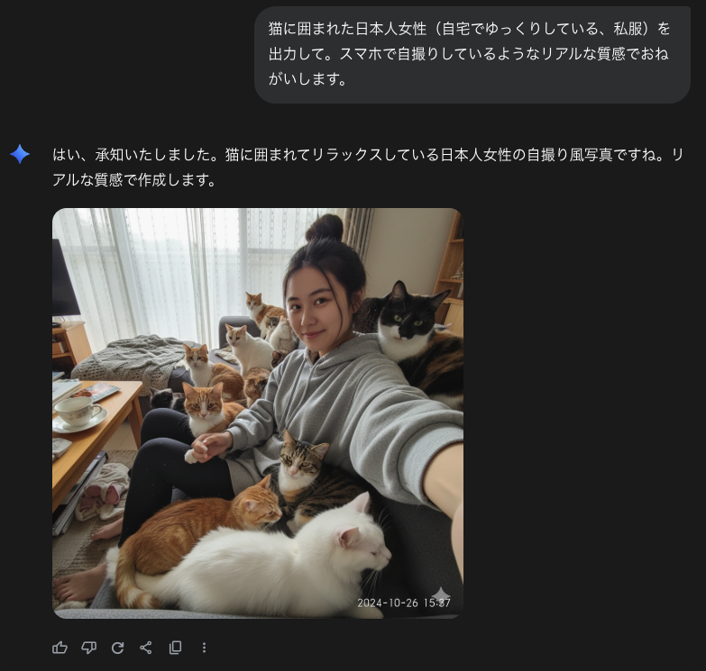
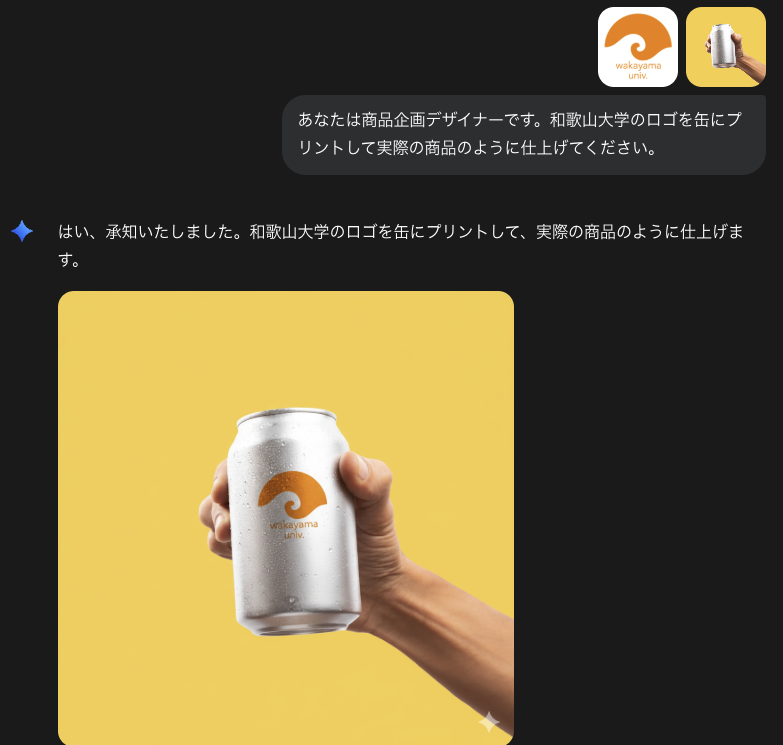

<!-- _class: lead -->
# AI技術の進化と地方創生

和歌山大学経済学部OB会 講演

---

## アジェンダ

1. **AI活用のフロントライン**
   - AI技術の基本と最前線

2. **AI活用の現在地**
   - 実際に使用しているツールと開発事例

3. **働き方への影響**
   - AIアプリ開発・業務改善がもたらす変化

4. **地域社会への影響**
   - 地方創生への可能性

---

<!-- _class: lead -->
# 1. AI活用のフロントライン

---

## 人工知能(AI)とは

### 🧠 基本的な定義

**AI (Artificial Intelligence / 人工知能)**
- 人間の知的活動（学習・推論・判断）をコンピュータで実現する技術
- データから学習し、パターンを認識して予測や判断を行う

### 📊 AIの種類

| 分類 | 説明 | 例 |
|------|------|-----|
| **特化型AI** | 特定のタスクに特化 | 画像認識、音声認識、翻訳 |
| **生成AI** | 新しいコンテンツを生成 | ChatGPT、画像生成、音楽生成 |
| **汎用AI** | 人間レベルの知能（研究段階） | まだ実現していない |

💡 **本日の焦点**: 実用化が進む「生成AI」の活用方法

---

## 生成AIの特徴

### ✨ 従来のAIとの違い

**従来のAI**
- データを分析・分類する
- 既存のパターンを認識
- 例: スパムメール検出、レコメンド機能

**生成AI（2023年〜）**
- 新しいコンテンツを創造する
- テキスト、画像、音声、動画、コードを生成
- 人間との自然な対話が可能

### 🚀 ビジネスへのインパクト

- **創造的作業の支援**: 文章作成、デザイン、コーディング
- **業務効率化**: 資料作成、データ分析、顧客対応
- **専門知識の民主化**: 誰でも高度な作業が可能に

---

## なぜ生成AIは急に賢くなったのか？

### 🔬 技術的なブレークスルー

**1. Transformerアーキテクチャ（2017年）**
- Google発表の新しいAI構造
- 文脈全体を理解する「Attention機構」

**2. スケーリング則の発見**
- パラメータ数を増やすほど性能が向上し続ける
- 従来のAI: 一定規模で性能が頭打ち
- 生成AI: 大規模化で飛躍的に性能向上

---

## パラメータ数の爆発的増加

### 📊 用語の整理

**パラメータ（Parameter）**
- AIモデルの「脳の神経回路」のようなもの
- 学習によって調整される数値（重み）の総数
- 多いほど複雑なパターンを記憶・理解できる
- **OpenAI/Anthropicが学習済み** → 我々は使うだけ

**学習データ量（Training Data）**
- モデルを訓練するために使うデータの量
- 例: GPT-4は数兆語のテキストで学習
- **OpenAI/Anthropicが事前に学習済み** → 我々は使うだけ

**コンテクスト長（Context Length）**
- 一度に処理できる入力の長さ
- 例: Gemini 2.0は100万トークン（≒本750冊分）
- **我々がプロンプトで渡す内容** → 我々が使うときに指定

### 🎯 つまり

| 要素 | 誰が用意？ | いつ？ | 我々の関与 |
|------|----------|-------|----------|
| **パラメータ** | OpenAI/Google等 | モデル開発時 | ❌ 触れない |
| **学習データ** | OpenAI/Google等 | モデル学習時 | ❌ 触れない |
| **コンテクスト** | **我々ユーザー** | **使用時** | ✅ **プロンプトで指定** |

💡 **重要**: パラメータと学習データは「完成品」。我々はコンテクスト（プロンプト）だけを渡す

---

## モデル規模の推移

### 📈 パラメータ数の進化

| 年 | モデル | パラメータ数 | 学習データ量 | 性能の変化 |
|-----|--------|------------|------------|----------|
| 2018 | GPT-1 | 1.2億 | 5GB | 基本的な文章生成 |
| 2019 | GPT-2 | 15億 | 40GB | より自然な文章 |
| 2020 | GPT-3 | 1,750億 | 570GB | 対話・推論が可能に |
| 2023 | GPT-4 | 推定1.8兆 | 推定13TB | 専門知識・複雑な推論 |
| 2025 | 最新モデル | 推定10兆超 | 推定100TB超 | ほぼ人間レベル |

💡 **驚きの事実**: パラメータ数が1000倍になると、質的に異なる能力が突然現れる

---

## 「なぜうまくいくのか」は実は謎

### 🤔 科学的に未解明な部分

**わかっていること:**
- 大規模化すると性能が向上する（実験的事実）
- 複雑なパターンを学習できる
- 膨大なデータから知識を獲得

**わかっていないこと:**
- なぜスケールアップで突然新しい能力が出現するのか
- 内部でどのように「理解」しているのか
- どこまで大規模化すれば良いのか

### 🎯 実用上の意味

**研究者:** 理論的理解を深めようと研究中
**ビジネス:** 理論不明でも実用可能 → **今使える技術**

💡 **重要**: 完全に理解されていないが、実用性は証明済み

---

## 豆知識: なぜ毎回答えが違うのか

### 🎲 生成AIの「ランダム性」

**文章生成の仕組み:**

1. 次の単語の**確率**を計算
   - 例: 「猫が魚を」→ 次は？
   - 食べた: 45% / 見た: 20% / 狙った: 15% ...

2. 確率に応じて**ランダムに選択**
   - 毎回同じとは限らない
   - Temperature設定で調整可能

### 💡 実用的な意味

- **同じ質問でも表現が変わる** → 自然な対話
- **創造性がある** → 多様なアイデア生成
- **完全に予測不可能ではない** → 確率的に制御されている

💡 **ポイント**: 「ランダム」だが「でたらめ」ではない。学習した知識に基づく確率的選択

---

## AI技術の分類

### 🤖 生成AI基盤モデル
- **ChatGPT** (OpenAI) - 汎用対話型AI
- **Claude** (Anthropic) - 長文理解・コーディング特化
- **Gemini** (Google) - マルチモーダル対応

### 🔧 特性の違い
- 得意分野が異なる
- 使い分けることで最大効果
- 日々進化している

---

## 生成AIの進化: 競争の激化

### 📈 2023-2025年の急速な発展

| 時期 | マイルストーン |
|------|--------------|
| 2023年3月 | GPT-4リリース（マルチモーダル） |
| 2023年11月 | GPTs・カスタムモデル登場 |
| 2024年 | Claude 3.5 Sonnet（コーディング性能向上） |
| 2024年末 | MCP（Model Context Protocol）登場 |
| 2025年 | エージェント型AI実用化加速 |

---

## AIモデル競争: 主要プレイヤーの乱立 (1/2)

### 🏢 各社の最新モデルラインナップ（2024-2025年）

| 企業 | 主要モデル | 特化領域 | リリース頻度 |
|------|----------|---------|------------|
| **OpenAI** | GPT-5, GPT-5 Codex, GPT-4o, o1, o1-mini, o3, o3-mini | 汎用・推論・コード | 月次更新 |
| **Anthropic** | Claude 4.1 Opus, 4.5 Sonnet, 3.7 Sonnet, 3.5 Sonnet | コード・長文 | 月次更新 |
| **Google** | Gemini 2.0 Pro/Flash/Ultra, 1.5 Pro, Gemma 3 | マルチモーダル | 月次更新 |

---

## AIモデル競争: 主要プレイヤーの乱立 (2/2)

### 🏢 各社の最新モデルラインナップ（2024-2025年）

| 企業 | 主要モデル | 特化領域 | リリース頻度 |
|------|----------|---------|------------|
| **Meta** | Llama 4 (405B), 3.3 (8B/70B/405B) | オープンソース | 四半期更新 |
| **Microsoft** | Phi-5, Phi-4 Mini/Medium, Copilot | エッジAI・統合 | 月次更新 |
| **Amazon** | Nova Pro/Ultra, Titan Multimodal | AWS統合 | 月次更新 |

---

## 中国・その他の追い上げ

### 🌏 グローバル競争の実態

| 企業/地域 | 主要モデル | 特徴 |
|----------|----------|------|
| **Alibaba** | Qwen 3 (0.5B-235B), QwQ-32B | 多言語・超大規模 |
| **DeepSeek** | DeepSeek V3, R1-Lite-Preview | 推論特化・低コスト |
| **Mistral AI** | Mistral Large 2, Small 3, Codestral 25.01 | 欧州発・効率重視 |
| **xAI** | Grok-3, Grok-Vision | リアルタイム・画像理解 |
| **Cohere** | Command R7B, Command R+ 08-2024 | 企業向け・RAG最適化 |

💡 **ポイント**: 毎週新モデル・アップデートがリリースされる超競争時代

---

## モデル性能の急速な向上 (1/2)

### 📊 ベンチマーク推移（2023-2025年）

| 能力領域 | 2023年初 | 2024年初 | 2025年10月 |
|---------|---------|---------|-----------|
| **コーディング** | 67% → | 85% → | **96%** (GPT-5 Codex) |
| **数学推論** | 52% → | 78% → | **94%** (o3) |
| **長文理解** | 32K tokens → | 128K tokens → | **1M tokens** (Gemini 2.0) |
| **マルチモーダル** | テキスト+画像 → | +音声+動画 → | **リアルタイム音声対話** |
| **推論能力** | 基本 → | Chain-of-Thought → | **深層推論** (o-series, R1) |

---

## モデル性能の急速な向上 (2/2)

### 🚀 競争がもたらす恩恵

- **性能向上**: 6-12ヶ月で2倍の性能改善
- **コスト低下**: API価格が年間60-80%低下（DeepSeek効果）
- **機能多様化**: 推論特化、コード特化、マルチモーダル特化モデル
- **オープンソース化**: Llama 4、Qwen 3等の高性能オープンモデル

---

## AI派生サービスの広がり

### 💻 開発ツール

- **Cursor / Claude Code** - AI統合開発環境
- **GitHub Copilot** - コード補完
- **v0.dev / Bolt.new** - UI自動生成

### 🔍 業務支援

- **Perplexity** - AI検索エンジン
- **NotebookLM** - 資料分析・要約
- **ChatPDF** - PDF対話分析

---

## 拡張技術: MCP・RAG・エージェント

### 🔌 MCP (Model Context Protocol)
- AIに外部ツール・データを接続
- ブラウザ操作、データベース連携など

### 📚 RAG (Retrieval Augmented Generation)
- 独自データベースとAIの統合
- 社内文書・専門知識の活用

### 🤖 AIエージェント
- 自律的にタスクを実行
- 複雑な業務の自動化

---

<!-- _class: lead -->
# 2. AI活用の現在地

---

## 日常的に使用するAIツール

### 🗣️ 対話型AI
- **ChatGPT**: アイデア出し、文章作成、調査
- **Claude**: コードレビュー、長文分析
- **Gemini**: Google Workspace統合

### 🛠️ 開発ツール
- **Cursor / Claude Code**: フルスタック開発支援
- **GitHub Copilot**: リアルタイムコード補完
- **v0.dev**: React/Next.jsコンポーネント生成

---

## 業務改善事例

### 📝 ドキュメント作成
- 議事録: 音声→自動文字起こし→要約
- 報告書: フォーマット自動生成
- **時間削減**: 70-80%

### 📊 データ分析
- Excel/CSV → AI分析→可視化
- 専門知識不要でインサイト抽出
- **民主化**: 非データサイエンティストでも分析可能

---

## 業務改善事例（続き）

### 💬 顧客対応

- FAQチャットボット
- メール自動返信
- 多言語対応（インバウンド観光）

### 🎨 クリエイティブ

- マーケティング文案
- プレゼン資料作成
- 画像・動画編集支援

---

## 画像生成AI: 実用事例

<div style="display: grid; grid-template-columns: 1fr 1fr; gap: 30px;">

<div>

### 🎨 2025年の画像生成クオリティ



**実例**: このような写真と見分けがつかないリアルな画像を、テキストで指示するだけで生成可能

</div>

<div>

### 主要な画像生成AI

| サービス | 特徴 |
|---------|------|
| **Midjourney v7** | 超リアルな写真生成 |
| **DALL-E 4** | テキスト統合・編集 |
| **Stable Diffusion 4** | カスタマイズ自由 |
| **Ideogram 3.0** | 文字入り画像生成 |

</div>

</div>

---

## 画像生成AI: ビジネス活用

### 💼 実際の活用シーン

- **マーケティング素材作成**
  - 商品イメージ、広告ビジュアル
  - SNS投稿用画像（従来の1/10のコスト）

- **Webサイト・資料制作**
  - プレゼン用イラスト・図解
  - ブログ記事のアイキャッチ画像

- **プロトタイプ作成**
  - UI/UXデザインのモックアップ
  - パッケージデザインの試作

💡 **ポイント**: 専門デザイナー不在でもプロ級のビジュアル制作が可能に

---

## 実例: 商品モックアップ生成

<div style="display: grid; grid-template-columns: 1fr 1fr; gap: 30px;">

<div>

### 🎯 営業・企画担当者でもできる商品ビジュアル制作


</div>

<div>

**作業手順**: わずか3ステップ

1. ロゴ画像を用意（既存のロゴデータ）
2. AIに指示「このロゴを缶に配置して商品写真風に」
3. 数秒で完成 → 営業資料・提案書に即利用可能

</div>

</div>

---

## 実際のプロンプト例

<div style="display: grid; grid-template-columns: 1fr 1fr; gap: 30px;">

<div>

### 📝 AIへの指示内容



**実際の指示文**:

```
あなたは商品企画デザイナーです。
和歌山大学のロゴを缶にプリント
して実際の商品のように仕上げて
ください。
```

</div>

<div>

### ✨ 結果

- **所要時間**: 約10秒
- **修正回数**: 1回のプロンプトで完成
- **追加作業**: 不要（そのまま提案資料に使用可能）

💡 **誰でもできる**: 特別なスキル不要、日本語で指示するだけ

</div>

</div>

---

## 商品ビジュアル制作の比較

### 📊 従来手法 vs AI活用

| 項目 | 従来の制作方法 | AI活用 |
|------|--------------|--------|
| **時間** | 3-5日（デザイナー依頼） | 数分 |
| **コスト** | 5-10万円 | ほぼ無料 |
| **修正** | 再依頼が必要（追加費用） | その場で即修正 |
| **制作者** | 専門デザイナー | 営業・企画担当者自身 |
| **バリエーション** | 1-2案 | 無制限 |

💡 **地方企業への恩恵**: デザイナー不在でも商品提案・企画が可能に

---

## 実際の開発事例

### ⚡ Webアプリケーション開発
**従来**: 2-3週間
**AI活用**: 2-3日

#### 開発プロセス
1. 要件定義（AIと対話）
2. アーキテクチャ設計（AI提案）
3. コード生成・実装（AI支援）
4. テスト・デバッグ（AI分析）
5. ドキュメント生成（AI自動化）

---

## 開発事例: 具体例

### 📱 事例1: 社内業務アプリ
- **内容**: タスク管理・進捗可視化システム
- **工数削減**: 80%削減（従来15日→3日）
- **使用ツール**: Claude Code, v0.dev

### 🌐 事例2: 顧客向けWebサービス
- **内容**: 予約管理・決済システム
- **特徴**: 非エンジニアでも修正可能に
- **使用ツール**: Cursor, ChatGPT

---

## 実例: LP（ランディングページ）制作

### 🚀 v0.devで一瞬でLP作成

**従来のLP制作**
- デザイン: 3-5日
- コーディング: 3-5日
- **合計**: 1-2週間

**v0.dev活用**
- デザイン生成: 数分
- コード実装: 1日以内
- **合計**: 1日

### 💼 実際の制作事例

- **https://clean-connect.org** - v0.devで1日で制作
- **https://kaze.jp** - v0.devで1日で制作
- **https://sunyx.jp** - v0.devで1日で制作

💡 **ポイント**: 見た目を一発で生成 → コードに落とすだけで完成

---

## 実例: カスタムAIシステム開発

### 🤖 自社要件に合わせたAI構築

**従来のAI開発**
- 要件定義・設計: 2-4週間
- モデル開発・学習: 4-8週間
- 統合・テスト: 2-4週間
- **合計**: 2-4ヶ月、コスト数百万円〜

**AI活用での開発**
- 基盤モデル選定: 1日
- カスタマイズ・統合: 1-2週間
- **合計**: 2-3週間、大幅なコスト削減

---

## カスタムAI: 具体的な活用例

### 💼 実際に構築できるシステム例

**社内ナレッジAI**
- 社内マニュアル・過去事例を学習
- 社員からの質問に即座に回答
- 業務効率化・新人教育の加速

**経路検索・最適化AI**
- 配送ルート最適化
- 観光ルート提案
- 混雑予測・分散提案

**顧客対応AI**
- 業界特化型チャットボット
- 多言語対応（観光・インバウンド）
- 24時間自動応答

**専門分野アシスタント**
- 医療・法律・会計など専門知識の支援
- 社内データベース検索・分析
- レポート自動生成

---

## Vertex AI とは

### 🔧 AI開発プラットフォームの種類

**統合AI開発プラットフォーム（カスタマイズ・ファインチューニング可能）**

| サービス | 提供元 | 特徴 |
|---------|--------|------|
| **Vertex AI** | Google Cloud | 統合プラットフォーム、自社データ学習、BigQuery連携 |
| **Azure AI** | Microsoft | Azure統合、自社データ学習、Copilot活用 |
| **Amazon Bedrock** | AWS | 複数モデル選択、カスタマイズ、AWS統合 |

**LLM API（モデルを直接呼び出し）**

| サービス | 提供元 | 特徴 |
|---------|--------|------|
| **Claude API** | Anthropic | 長文処理・コード特化、プロンプトのみ |
| **OpenAI API** | OpenAI | GPTシリーズ、プロンプトのみ |
| **Gemini API** | Google | マルチモーダル、プロンプトのみ |

💡 **違い**: プラットフォーム型は自社データで学習可能、API型はプロンプトで活用

---

## 実際の開発ワークフロー

```
1. 💭 要件整理
   ↓ (AI対話で明確化)

2. 🏗️ 設計
   ↓ (AIが複数案提示)

3. ⚙️ 実装
   ↓ (AIコード生成→人間レビュー)

4. ✅ テスト
   ↓ (AI自動テスト生成)

5. 🚀 デプロイ
   ↓ (手順自動化)

6. 📚 ドキュメント化
   (AIが自動生成)
```

---

<!-- _class: lead -->
# 3. 働き方への影響

---

## スキルシフトの進行

### 📚 従来のスキル → 🚀 これからのスキル

| 従来 | これから |
|------|---------|
| コーディング技術 | **問題定義・要件整理** |
| 情報検索 | **情報統合・判断** |
| 単純作業の実行 | **創造的タスクへの集中** |
| 専門知識の暗記 | **AIを使った知識活用** |

💡 **本質**: 「どう作るか」→「何を作るべきか」

---

## 組織・チーム構造の変化

### 🏢 変化のポイント

1. **少人数での高度開発**
   - 1-2名で従来の5-10名分の開発が可能

2. **非エンジニアの開発参入**
   - ビジネス側が直接プロトタイプ作成

3. **リモート・非同期加速**
   - AIがドキュメント・コミュニケーション支援

---

## 新しい役割の誕生

### 🎯 新職種・スキルセット

- **プロンプトエンジニア**
  - AI活用の最適化専門家

- **AIインテグレーター**
  - 既存業務へのAI組み込み

- **AI倫理・ガバナンス担当**
  - 適切な利用ルール策定

---

## 課題と対策

### ⚠️ 主な課題

1. **スキル更新の必要性**
   - 継続的な学習が必須

2. **AI依存のリスク**
   - 基礎知識の空洞化

3. **雇用構造の変化**
   - 一部業務の自動化

### 💡 対策
- 基礎教育の重要性維持
- 人間ならではの価値（判断・創造性）の強化
- リスキリング支援

---

<!-- _class: lead -->
# 4. 地域社会への影響

---

## 地方創生の大きな機会

### 🌱 3つの可能性

1. **人材不足の解消**
   - 少人数でビジネス立ち上げ可能
   - 都市部との技術格差縮小

2. **地域産業のDX加速**
   - 農業・観光・製造業の効率化

3. **新ビジネスモデル創出**
   - 地域特化型AIサービス
   - リモート人材の地方移住

---

## 地域産業DX: 農業

### 🌾 農業×AI

- **データ分析・予測**
  - 気象データ→収穫時期最適化
  - 病害虫早期発見

- **効率化・省力化**
  - ドローン×AI（生育状況把握）
  - 自動水やり・施肥システム

- **販路拡大**
  - AI需要予測→生産計画
  - 多言語ECサイト運営

---

## 地域産業DX: 観光

### 🗾 観光×AI

- **多言語対応**
  - リアルタイム翻訳ガイド
  - 多言語Webサイト・SNS運営

- **パーソナライゼーション**
  - 旅行者の好みに応じた提案
  - 混雑状況の最適化

- **コンテンツ生成**
  - 観光PR動画・画像作成
  - SNSマーケティング自動化

---

## 地域産業DX: 製造業

### 🏭 製造×AI

- **品質管理**
  - 画像認識による不良品検出
  - 予知保全（故障予測）

- **業務効率化**
  - 在庫最適化
  - 受発注業務の自動化

- **技能継承**
  - ベテラン技術のデータ化
  - AIによる技術指導支援

---

## 和歌山での応用可能性

### 🍑 地域資源×AI

<div style="display: grid; grid-template-columns: 1fr 1fr; gap: 30px;">

<div>

**梅・みかん農業**
- 生育データ分析→品質向上
- AI選果システム
- ブランド戦略（データドリブン）

**高野山・熊野古道観光**
- 多言語AIガイド
- 巡礼者向けパーソナライズルート
- 混雑予測・分散化

</div>

<div>

**地域中小企業支援**
- AI導入コンサルティング
- 共同利用型AIツール開発

</div>

</div>

---

## 実装へのステップ

### 🚀 地域でAI活用を始めるには

1. **小さく始める**
   - 既存ツール（ChatGPT等）で業務改善
   - 成功体験の蓄積

2. **人材育成**
   - AI活用研修・ワークショップ
   - 地域コミュニティ形成

3. **共創エコシステム**
   - 産学官連携
   - 先進事例の共有

---

## 地方創生の成功パターン

### ✨ 重要な要素

- **トップのコミットメント**
  - 経営層・自治体のリーダーシップ

- **具体的な成功体験**
  - 「使えた」という実感の共有

- **継続的な学習環境**
  - 変化への対応力

💡 **鍵**: 「技術」ではなく「課題解決」視点

---

<!-- _class: lead -->
# まとめ

---

## まとめ: AI時代の地方創生

### 🎯 キーメッセージ

1. **AIは誰でも使えるツールに**
   - 特別な技術知識は不要
   - 重要なのは「何を実現したいか」

2. **地方こそAI活用の好機**
   - 人材不足→AIで補完
   - 地域資源×AIで新価値創造

3. **今すぐ始められる**
   - まずは既存ツールで小さく試す
   - 成功体験を積み重ねる

---

<!-- _class: lead -->
# ご清聴ありがとうございました

## Q&A

質問・ディスカッション

---
