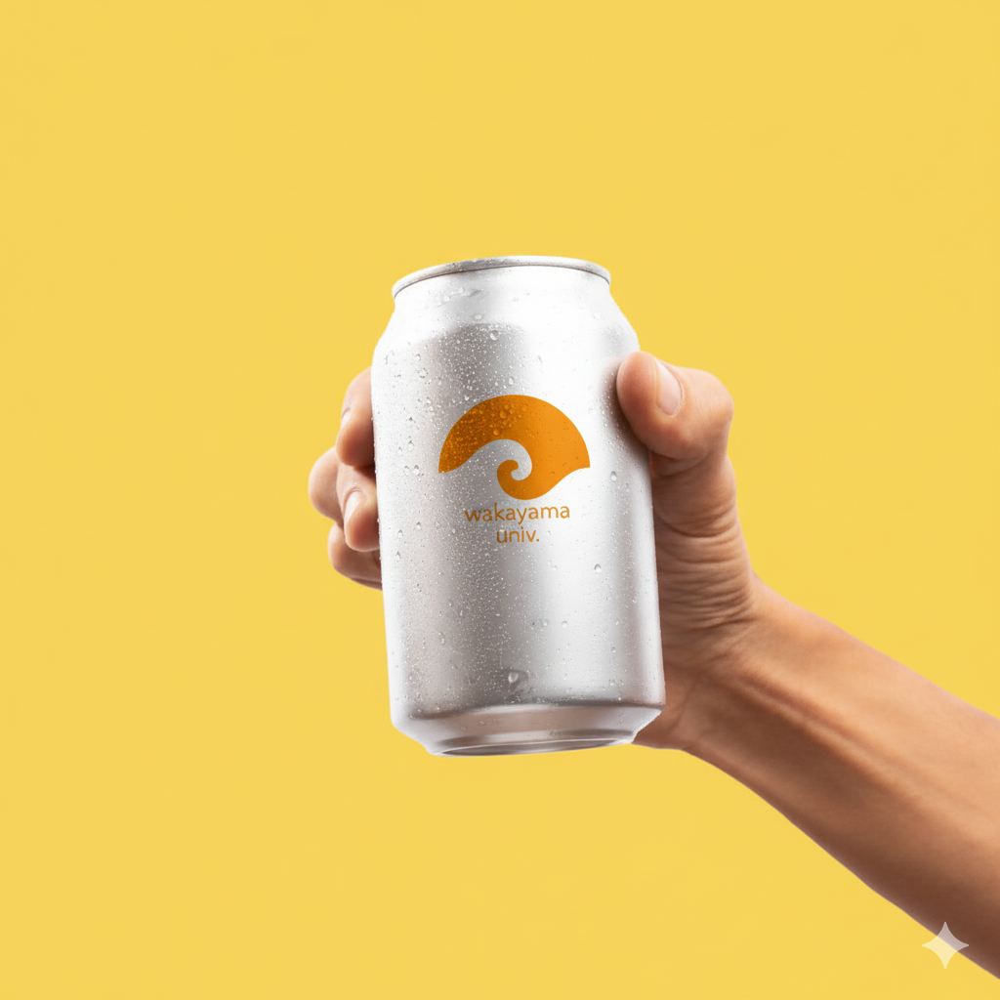

# 和歌山ぶらくり会 『AI技術の進化と地方創生』

---

## 生成AIとは何か

### 従来のAIと何が違う？

**従来のAI**

- データを「分類」する
- 例：スパムメールを検出する、写真に写っているのが犬か猫か判定する
- 人間が設定したルールに従って判断

**生成AI**

- 新しいコンテンツを「創造」する
- 例：文章を書く、画像を描く、プログラムを生成する
- 人間との自然な対話が可能

つまり、AIは「判定する機械」から「創造する機械」に進化しました。

---

### 生成AIはいつから？

生成AI（文章や画像を作るAI）自体は2010年代から存在していました。ただし当時は品質が低く、「AIが作った感」が明らかでした。

転機は2020年のGPT-3。「スケーリング則」——大きくすれば賢くなる——が実証され、人間が書いたような自然な文章を生成できるようになりました。

そして2022年11月、ChatGPTとして無料公開。誰でも触れるようになり、社会現象となりました。

---

### なぜ急に賢くなったのか

2つのブレークスルーがありました。

**1. Transformer（2017年）— 技術的基盤**

Googleが発表した新しいAI構造。文脈全体を一度に見渡せる仕組みにより、AIの大規模化が技術的に可能になりました。

**2. スケーリング則の発見（2020年頃）— 経験則**

「パラメータ・データ・計算量を増やすと、性能が予測可能に向上し続ける」という法則が発見されました。それまでのAIは規模を大きくしても性能が頭打ちになっていましたが、Transformerベースでは違いました。

| 年 | モデル | パラメータ数 | 性能の変化 |
|-----|--------|------------|------------|
| 2018 | GPT-1 | 1.2億 | 基本的な文章生成 |
| 2020 | GPT-3 | 1,750億 | 対話・推論が可能に |
| 2023 | GPT-4 | 推定1.8兆 | 専門知識・複雑な推論 |

パラメータ数が1000倍になると、突然「質的に異なる能力」が現れる。これを研究者は「創発」と呼んでいます。

---

### 正直に言うと：なぜうまくいくのかは謎

驚くかもしれませんが、**なぜこれほどうまく動くのか、科学者も完全には理解していません**。

わかっていること：

- 大規模化すると性能が向上する（実験的事実）
- 膨大なデータからパターンを学習している

わかっていないこと：

- なぜスケールアップで突然新しい能力が出現するのか
- 内部でどのように「理解」しているのか

完全に理解されていないが、実用性は証明済み。飛行機が飛ぶ原理を完全に理解していなくても飛行機に乗るように、私たちはAIを使い始めています。

---

## 【豆知識】なぜAIは毎回違う答えを返すのか

ChatGPTに同じ質問をしても、返ってくる答えは毎回微妙に違います。なぜでしょうか？

生成AIは、次の単語を「確率」で予測しています。

例：「猫が魚を」の次に来る単語は？

- 食べた：45%
- 見た：20%
- 狙った：15%
- ...

AIはこの確率に応じて**ランダムに選択**します。だから毎回少し違う表現になる。

ポイント：「ランダム」だが「でたらめ」ではない。学習した知識に基づく確率的選択です。これにより、AIは自然で多様な文章を生成できます。

---

## 知っておきたい基礎用語

暗記する必要はありません。講演中に出てきたら「あ、これか」と思い出せれば十分です。

### パラメータ（Parameter）

- AIの「脳の神経回路」のようなもの
- 学習によって調整される数値の総数
- OpenAIやGoogleが事前に学習済み → 私たちは使うだけ

### プロンプト（Prompt）

- AIへの指示文・質問文のこと
- 「〇〇について教えて」「△△を作って」という入力
- **私たちが工夫できる唯一の部分**

### コンテクスト（Context）

- AIに渡す文脈情報
- 「あなたは〇〇の専門家です」といった設定
- 長いほど精度が上がるが、限界がある

### ハルシネーション（Hallucination）

- AIが「もっともらしい嘘」を生成すること
- 存在しない事実、架空の引用などを作り出す
- 後述する「AIの限界」の代表例

---

## 今のAIでできること

### 文章生成

- ビジネスメール、報告書、企画書の下書き
- 議事録の要約
- 多言語翻訳

### 画像生成

- テキストで指示するだけで写真のようなリアルな画像を生成
- 商品モックアップ、広告ビジュアル、プレゼン資料用イラスト
- 専門デザイナーなしでプロ級のビジュアル制作が可能に

### コード生成

- Webサイト、業務アプリの開発支援
- 従来2〜3週間かかった開発が2〜3日に
- 非エンジニアでも修正・カスタマイズ可能に

---

### 実例：10秒で商品モックアップ

和歌山大学のロゴを用意し、AIに「このロゴを缶にプリントして商品写真風に」と指示。

**結果**：約10秒で完成。そのまま営業資料・提案書に使用可能。

| 項目 | 従来の制作 | AI活用 |
|------|-----------|--------|
| 時間 | 3〜5日 | 数分 |
| コスト | 5〜10万円 | ほぼ無料 |
| 修正 | 再依頼（追加費用） | その場で即修正 |
| 制作者 | 専門デザイナー | 誰でも |

---

## 主要プレイヤー（覚えなくていい）

競争が激化しており、毎月のように新モデルがリリースされています。名前を覚える必要はありませんが、「こんなに多くの会社が競っているのか」という感覚だけ持っておいてください。

| 企業 | 代表的なAI | 特徴 |
|------|-----------|------|
| OpenAI | ChatGPT, GPT-4 | 最も有名、汎用的 |
| Google | Gemini | 検索との統合 |
| Anthropic | Claude | 長文理解に強い |
| Meta | Llama | オープンソース |
| Microsoft | Copilot | Office製品と統合 |

日本語対応も急速に進んでおり、どのサービスも実用レベルで日本語が使えます。

---

## AIの限界・苦手なこと

AIは万能ではありません。以下の限界を理解しておくことが重要です。

### ハルシネーション（幻覚）

- 存在しない事実をもっともらしく語る
- 架空の論文、存在しない法律を引用することも
- **対策**：重要な情報は必ず裏取りする

### リアルタイム情報がない

- 学習データには期限がある（例：2024年1月まで）
- 「今日の天気」「最新ニュース」は基本的に答えられない
- **対策**：最新情報はWeb検索機能付きのAIを使う

### 計算・論理の限界

- 複雑な計算は間違えることがある
- 長い推論チェーンで矛盾が生じることも
- **対策**：計算は電卓、論理は人間がチェック

### 文脈の忘却

- 長い会話の途中で前の内容を忘れる
- **対策**：重要な前提は繰り返し伝える

---

## 「AIに仕事を奪われる？」

この質問はよく聞かれます。AIに聞いてみました。

> **Q: AIは人間の仕事を奪いますか？**
>
> **A（AIの回答）**: 「奪う」というより「変える」が正確です。
>
> 歴史を見ると、ATMは銀行員を消滅させず、むしろ銀行の支店を増やしました。窓口業務が減った分、銀行員はより高度な相談業務にシフトしました。
>
> AIも同様に、単純作業を代替する一方で、新しい役割を生み出すでしょう。消えるのは「仕事」ではなく「タスク」です。

---

## AIと人間の役割分担

AIに聞いた「これからの役割分担」です。

### AIが得意なこと

- 大量のデータ処理・分析
- 定型的な文章・画像の生成
- 24時間365日の対応
- 多言語への即時翻訳

### 人間にしかできないこと

- 「何をすべきか」の判断
- 文脈を踏まえた意思決定
- 創造的なアイデアの発想
- 信頼関係の構築
- 責任を取ること

### これからのスキル

| 従来 | これから |
|------|---------|
| 情報を探す | 情報を統合・判断する |
| 作業を実行する | 何を作るべきか考える |
| 専門知識を暗記する | AIを使って知識を活用する |

「どう作るか」より「何を作るべきか」が問われる時代になります。

---

## AI時代に必要な備え

技術は進化し続けます。ChatGPTの登場から2年で、AIの性能は数十倍に向上しました。この流れは止まりません。では、私たちは何を備えればいいのか。

### 1. マインドセット
まずは試してみる。アップデートの速度が早いので、最新のAIのできることを知るためにも、生活や仕事、趣味のサポートにAIを活用してみてください。

### 2. 情報の整理

AIは万能に見えますが、紙の書類は読めません。PDFやWordに変換されていても、スキャン画像のままでは大量の中身を理解できません。

AIを生活や仕事に活かすには、情報が「AIに読める形」で整理されている必要があります。

- 家計簿：手書き帳簿 → 会計ソフト
- 売り上げ情報 → CRM/データベース
- 業務マニュアル：紙のファイル → 電子ドキュメント
- 社内ノウハウ：ベテランの頭の中 → 文書化

デジタル化は、AI活用の「入場券」です。これがないと、どれだけAIが進化しても恩恵を受けられません。

### 3. 人：AIと人間をつなぐ役割

AIは勝手に動きません。「何をさせるか」を考え、指示を出し、結果を判断する人間が必要です。

プログラミングができる必要はありません。しかし「AIに何ができるか」を理解し、「自分の仕事のどこに使えるか」を考えられる人材は不可欠です。

---

## まとめ

1. **生成AIは「創造する機械」** — 分類から創造へ進化した
2. **2020年頃から急に賢くなった** — スケーリング則の発見がきっかけ
3. **なぜ賢くなったかは、実は謎** — でも使えることは証明済み
4. **できることは多いが、限界もある** — ハルシネーションに注意
5. **仕事は「奪われる」より「変わる」** — 人間の役割も変化する
6. **備えは3つ** — マインドセット、情報の整理、人材

---

経済69期 中村
この文章はClaude Codeで作成しました